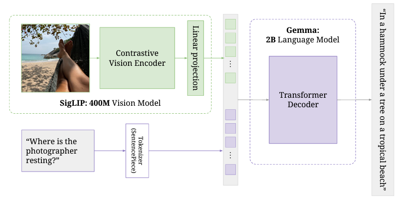

# PaliGemma: Multimodal Vision Language Model
## About the project
This repository contains an implementation of [PaliGemma](https://arxiv.org/abs/2407.07726), a multimodal (Vision) language model written from scratch in PyTorch. The code is based on the tutorial video [‘Coding a Multimodal (Vision) Language Model from scratch in PyTorch with full explanation’](https://www.youtube.com/watch?v=vAmKB7iPkWw&t=12829s&ab_channel=UmarJamil).



The main goal of the project is to deepen the understanding of the device of multimodal models and improve programming skills in PyTorch.

## How to start
### Prerequisites
Before you start, make sure you have the following dependencies installed:
```
- python = ^3.11
- torch = ^2.5.1
- numpy = ^2.2.1
- pillow = ^11.1.0
- fire = ^0.7.0
- transformers = ^4.48.0
```
1. Clone the repository:
```commandline
git clone https://github.com/vlvink/PaliGemma-from-scratch.git
cd PaliGemma-from-scratch
```
2. Install the requirements
```commandline
poetry install
```
3. Setting the poetry environment
```commandline
poetry shell
```

###  Running the Code
```commandline
./launch_inference.sh
```